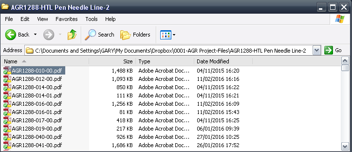
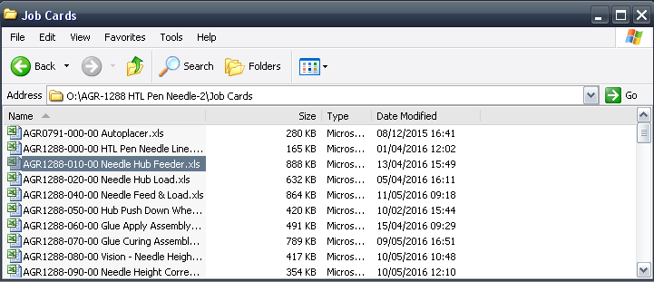
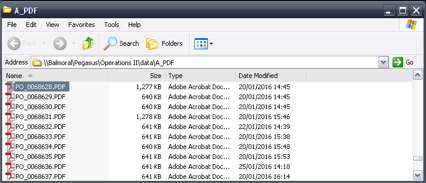
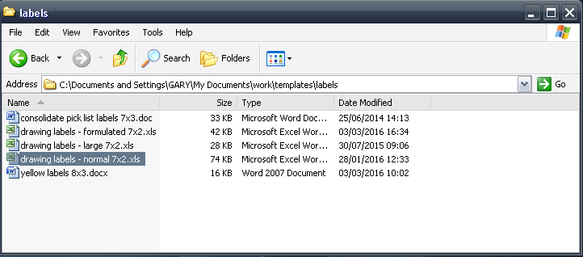

Quick Start
===========

Open the following files quickly:

-------
Drawing
-------

>>> import shortcut
>>> shortcut.drawing('AGR1288-010-00')

-------
Jobcard
-------

>>> shortcut.jobcard('AGR1288-010-00')

-------
PO
-------

>>> shortcut.po(68628)

-------
Sticker
-------

>>> shortcut.sticker()

